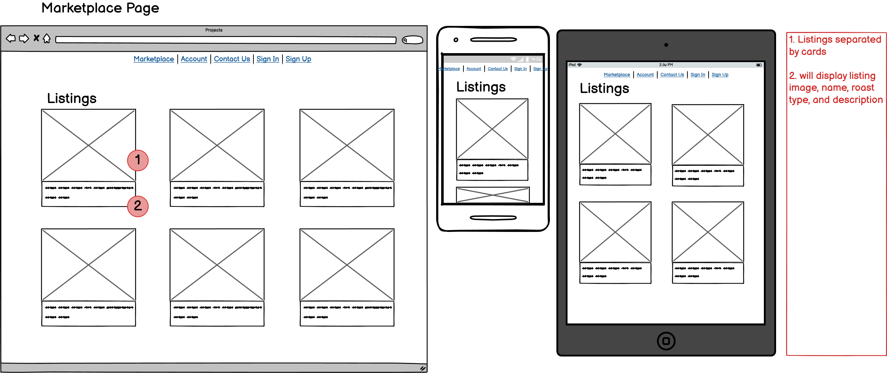
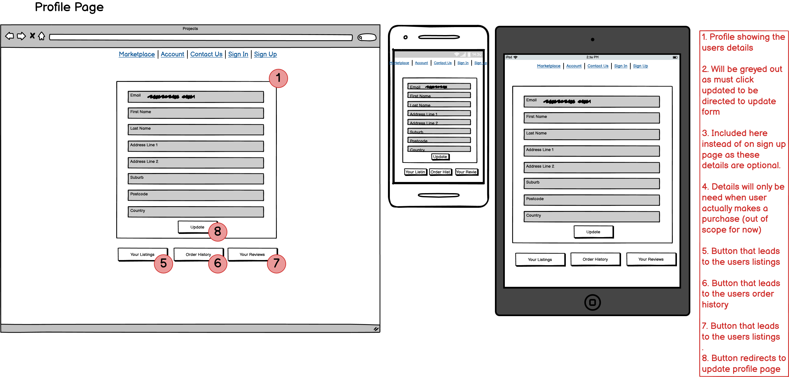

# roastXpress Two-way Marketplace Application

# [̲̅r][̲̅o][̲̅a][̲̅s][̲̅t][̲̅X][̲̅p][̲̅r][̲̅e][̲̅s][̲̅s]

## Links

### Github Repository Link

[Github Repository](https://github.com/rayves/roastXpress)

### Deployed Website

[roastxpress website](https://roastxpress.herokuapp.com/) 

## Purpose 

The purpose of the marketplace app is to design a functional two-way marketplace between coffee buyers and suppliers that is easy to use. The site will allow suppliers/sellers an effective way to display their roasted coffee to sell and for potential buyers to be able browse and purchase from the marketplace. 

## Identified Problem/Target Audience

The marketplace app is a one stop shop for people or cafes looking to buy coffee, or cafés and roasters looking to sell coffee. The idea behind this marketplace arose as there is a fair abundance of roasters and cafes that sell coffee to consumers; however, most places generally sell a few specific brands or coffee from few places of origin, or aren’t selling their coffee online at all. 

Purchases of coffee for home use during the covid-19 pandemic rose significantly in comparison to usual periods. People wanted to still get their coffees from their favourite shops so they started buying the beans to make the coffee themselves! This would have benefited the already technologically prepared stores with their own online marketplaces however others needed to quickly adapt by creating very barebones websites just to remain competitive. 

https://www.statista.com/statistics/1118657/australia-distribution-coffee-consumption-at-home-during-covid-19-by-type/ 

The goal of this marketplace is to be the all-encompassing coffee enthusiast marketplace where there is a wide variety of coffee from all roasters and countries who are willing to list their products. 

The marketplace can also be a good starting place for some new up in coming coffee roasters who want to make a name for themselves in the world of coffee. 

The initial stage for this app is to be a simple listing marketplace, however in the future there can even be plans to make the app a place where all coffee enthusiast go to discuss their love of coffee or start collaborations. 

## User stories
|            | Visitors|
|------------|-------|
| Epic| As a visitor I want to be able to sign up for an account to buy and sell products.|
| User Story | As a visitor I want to be able to see listings without having to make a purchase.|
| User Story | As a visitor, I want to easily have the option to buy or sell products.|

|            | Seller|
|------------|---------|
| Epic       | As a seller, I want to be able to list and display a product to sell.|
| User Story | As a seller, I want my listings to show informative details and images to show the buyer exactly what they are purchasing.|
| User Story | As a seller I want to be able to sell my products until it is sold out.|
| User Story | As a seller I want to be able to see all my listings so I can manage them easily.|

|  | Buyer |
|---|---|
| Epic | As a buyer, I want to be able to view all products for sale and make a purchase. |
| User Story | As a buyer, I want to be able to see all product listings on a single page so I can easily see different options. |
| User Story | As a buyer, I want to be able to see detailed information on a product so I know what I am purchasing. |
| User Story | As a buyer I want my personal information to be handled safely. |
| User Story | As a buyer I want to be able to have a record of my purchase and view all my previous purchases |


## Functionality/Features

1. User Accounts 
   1. Users can sign up creating a persisted user account that is stored within the database which they can use again to sign in. 
2. Marketplace Listings 
   1. A marketplace the displays all listings that are available for purchase. 
3. Listing Creation 
   1. Users can create listings for purchase which will take in a number of details that will be displayed on the individual listings show page. 
4. Listing purchase 
   1. Users can view listings without being logged in, however when they wish to make a purchase, they must log in. 
   2. Listings cannot be purchased by the lister themselves (weird to mention but valid). 
   3. If logged in they can click a buy button which will direct then to a checkout page through the stripe API where they can add their details confirming purchase. 
   4. Once purchase is completed the user is directed to a success page which confirms their purchase and displays a receipt link for them to click and view. 
5. Stripe API 
   1. Checkout is processed through Stripe’s API which handles sensitive payment details and the payment process so this information does not need to be stored within the roastXpress rails application. 
   2. Creates a receipt of the transaction which can be accessed by the app. 
6. User profile 
   1. Although incomplete, users have access to their personal profile page where they can navigate from there to their personal listings page and order history. 
7. Personal Listings Page
   1. Page where users can see their created listings that are currently available on the marketplace app. 
8. Order History Page
   1. Page where users can see all their previous purchase orders. They can further view be directed to the listing they purchased or view the receipt of that purchase. 

### Sitemap


### Changes

#### Create Listings

The sitemap originally made it only possible to create listings via the see my listings page, however as development of the app progressed this was changed so that the create listing option is available in the navigator so that create listing can be accessed on any page. This change was made as the main focus of the app currently is to be a two-way marketplace. In the future when the app develops further into the coffee industry network as discussed earlier changes may be made again. 

#### Future Features

##### Review Function

In the interest of time this concept was shifted to future development features as it was not a priority.

##### Profile details

Profile details feature in which the user can add their personal information is also shifted to future development in the interest of time.

### Notes

- The marketplace currently can only allows purchase of 1 item at a time. Functionality to allow purchase of multiple items and multiple quantities will need to be researched and revisited in the future. Item quantity already exists so items can be continuously purchased until quantities reach 0.
- Functionality took priority for this project so styling is either basic or absent as this can be completed at a later time.

### Root Page


### User Accounts


### Marketplace Listings 



### Listing Creation 


### Listing Purchase 


### Stripe API 


### User profile 




### Personal Listings Page


### Order History Page


### Pending Pages

The contact us and about us pages were not completed at this present time. However routes have been created to placeholder pages in preparation for the development of those pages.

#### Contact Us


#### About Us 


#### Review Page


As was mentioned above, this feature was put on hold in order to focus on the delivery of a product that met the current required needs.
 
## Entity Relationship Diagram (ERD)

 

##  High-level Components (Abstractions)

The main framework behind the application is Ruby on Rails which is based around the MVC design pattern.

One of the most prominent features of the model (M) component that Rails utilizes is Active Record. Active Record facilitates the communication of an application to the database by creating a class on the application level of the database table, thus turning that table's columns into objects which the application can actively reference. This Active Record relationship is also known as object relational mapping. Through Active Record communication with the database without the need to directly write SQL is possible and further, through inheritance multiple classes with Active Record features can be easily created as inheritance allows one class to 'inherit' the methods/actions of another class (i.e. the Active Record class) [^1].

Another significant feature of MVC is the Application Controller within the controller (C) component. The Application controller is the class that allows the creation of controllers that coordinate the interactions between the views and the model. Again, creation of controller is done through inheritance of this Application Controller. The Application Controller class inherits from the ActionContrller::Base which provides it will its special actions, such as rendering and executing requests[^2].

[^1]: https://guides.rubyonrails.org/active_record_basics.html
[^2]: https://api.rubyonrails.org/v7.0.2.3/classes/ActionController/Base.html

## Third Party Services

### AWS S3

Cloud Storage for images. 

When users create listings, they have the option to upload images which will be stored in Amazon's S3 cloud storage. The image can later be called in the view.

### Stripe

Stripe is utilized as a third party payment services provider which handles the checkout process of purchasing the products. Stripe is an external party which has PCI DSS Compliance, meaning they are compliant with the standards required to handle cardholder data. Using Stripe as an API provides users with a safe and secure method of checkout and simplifies that process on the application end.

### Heroku

Deployment for Rails applications with Heroku is ideal as Rails application can integrate easily with Heroku's systems. An explanation of this may be as Heroku was started with ruby the language Rails is based on so full support for ruby has existed since Heroku's inception.


## Active record associations

Flavor

```ruby
  has_many :listings_flavors
  has_many :listings, through: :listings_flavors
```
Listings have many flavors and flavors can have many listings therefore these two models have a many to many relationship. However in order to facilitate this many to many relationship a joining table (listings_flavors) needs to be the intemediary between these two models in order to adhere to the table normal forms where each column has only one value. The joining table facilitates the many to many relationship by storing the a single id from the listings table with a single id from the flavor table. If a listing has multiple flavors then that listing id will have a row for each flavor it has[^3].

[^3]: https://fmhelp.filemaker.com/help/18/fmp/en/index.html#page/FMP_Help/many-to-many-relationships.html

**Grind Type**

```ruby
  has_many :listings
```
The grind type model has_many listings because each listing has a type, and sellers can create as many listings, so grind types will be associated with many listings.


**Listing**

```ruby
  belongs_to :grind_type
  belongs_to :user
  has_many :listings_flavors, dependent: :destroy
  has_many :flavors, through: :listings_flavors
  has_one_attached :picture
```
- a listing belongs to a grind type as a listing must have a grind type in order to exist.
- a listing belongs to a user as a listing must have a user in order to exist.
- a listing has many flavors and listings flavors as is explained under the flavor relationship explanation.
- a listing has_one_attached picture which allows users to update one picture.

**Listings Flavor**

```ruby
  belongs_to :listing
  belongs_to :flavor
```
Listings Flavor is a joining table that allows the creation of the many to many relationship between listings and flavors as is discussed in more detail under the flavors relationship.

**Order**

```ruby
  belongs_to :listing
  belongs_to :buyer, foreign_key: "buyer_id", class_name: "User"
  belongs_to :seller, foreign_key: "seller_id", class_name: "User"
```
Operating in a comparable way as the Listings Flavor model, Orders is a joining table that allows the creation of the many to many relationship between listings and users. However Order differs in its purpose is not to be an intermediary between the two models but it references the listings and user models in order to create its own record. That being an Order that tracks the listing to the user id of the purchaser and the user id of the seller.


**User**
```ruby
  has_many :listings
  has_many :sold_orders, foreign_key: "seller_id", class_name: "Order"
  has_many :bought_orders, foreign_key: "buyer_id", class_name: "Order"
```
- A user has many listings as a listing must have a user and a user can have many listings.
- A user has many sold orders and bought orders through the Order model.


## Database relations

Relationships between tables within a database are created through primary and foreign keys. These relationships link tables together and create a system where one table can reference information from another table. A foreign key in one table references the primary key in another table allowing data from the primary key table to be referred to by the foreign key table

The Database relationships in the roastXpress app expands further from the model relationships by specifying the exact columns that are linked allowing the existence of the relationships.

```ruby
  add_foreign_key "listings", "grind_types"
  add_foreign_key "listings", "users"
  add_foreign_key "listings_flavors", "flavors"
  add_foreign_key "listings_flavors", "listings"
  add_foreign_key "orders", "listings"
  add_foreign_key "orders", "users", column: "buyer_id"
  add_foreign_key "orders", "users", column: "seller_id"
```

As can been seen by this extract from the apps schema, listings has the foreign keys grind_types and users. This creates a link between users, listings, and grind types allowing for data to be referenced between all three tables through each other.

For Example

```ruby
User.first.listing.first.grind_type
```

This will return the grind type of the first listing that belongs to the first user which generates the below SQL statement.

```SQL
  User Load (0.3ms)  SELECT "users".* FROM "users" ORDER BY "users"."id" ASC LIMIT $1  [["LIMIT", 1]]
  Listing Load (0.2ms)  SELECT "listings".* FROM "listings" WHERE "listings"."user_id" = $1 ORDER BY "listings"."id" 
ASC LIMIT $2  [["user_id", 1], ["LIMIT", 1]]
  GrindType Load (0.1ms)  SELECT "grind_types".* FROM "grind_types" WHERE "grind_types"."id" = $1 LIMIT $2  [["id", 5], ["LIMIT", 1]]
 =>
#<GrindType:0x00007fb538489488
 id: 5,
 name: "extra coarse",
 created_at: Tue, 29 Mar 2022 02:48:49.788546000 UTC +00:00,
 updated_at: Tue, 29 Mar 2022 02:48:49.788546000 UTC +00:00>
```

```ruby
GrindType.last.listings.last.user
```

This will return the user of the last listing of the last grind type which generates the below SQL statement.


```SQL
  GrindType Load (0.3ms)  SELECT "grind_types".* FROM "grind_types" ORDER BY "grind_types"."id" DESC LIMIT $1  [["LIMIT", 1]]
  Listing Load (0.2ms)  SELECT "listings".* FROM "listings" WHERE "listings"."grind_type_id" = $1 ORDER BY "listings"."id" DESC LIMIT $2  [["grind_type_id", 5], ["LIMIT", 1]]
  User Load (0.2ms)  SELECT "users".* FROM "users" WHERE "users"."id" = $1 LIMIT $2  [["id", 1], ["LIMIT", 1]]       
 => #<User id: 1, email: "test@sample.com", created_at: "2022-03-29 02:48:50.851905000 +0000", updated_at: "2022-03-29 02:48:50.851905000 +0000">
```


## Database schema design 

Planning of the ERD is one of the most important phases within the development process as it directed the order of tables to be created so a decent amount of time was spent on this planning stage.

The Database schema design differs from the ERD mainly in that the schema is missing the reviews, listing_reviews and profiles tables. These tables as was previously discussed were not developed at this point in time as to focus on delivering an app the met the current requirements. These features are planned to be implemented in the future.

Creation of the schema started with the creation of the tables that have no dependencies (foreign keys) as tables with dependencies cannot be created if the tables they depend on don't yet exist. This means the user table was first, then flavors, and then grind_types. The roast types table was later replaced as an enumerable instead as the number of roast types is unlikely to change so it would be more efficient to not have to reference a database table to call this information for use.

The parts under the most scrutiny was the implementation of the relationships between the tables as improper linking of tables could lead to problems as the development process progresses. So after each implementation, a considerable amount of time was spent testing that references executed as planned.


## Project Management


[Trello](https://trello.com/b/2geKEq0u/roastxpress) was used to track the progress of the project.

Planning stage required considerable amount of time especially the ERD as the ERD maps the entire database structure of the app. Although the database can be altered further down the development process, it is more difficult to make a change to a database later rather than planning and implementing it as planned a the beginning.

The main focus of prioritizing tasks was to meet the minimum needs in order to provide a deliverable app first then build up from that foundation. As has been mentioned before, features were pushed to future development times, however a working app is able to be delivered that meets the required criteria.

## Tech stack

- **Backend**
  - Ruby
  - Ruby on rails
  - PostgreSQL – Database 
- **Front-end**
  - HTML
  - CSS/Sass/Bootstrap
  - Ruby on rails
- **Deployment**
  - Heroku 
- **APIs**
  - Payment system - Stripe 
  - Image hosting - AWS S3 